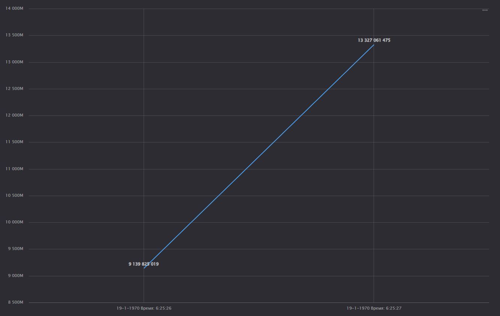

Применение технологий ИИ и машинного обучения для поиска угроз ИБ
================
Zhidkov Georgy

Лабораторная работа №2

> Использование технологии Yandex DataLens для анализа данных сетевой
> активности

## Цель

1.  Изучить возможности технологии Yandex DataLens для визуального
    анализа структурированных наборов данных
2.  Получить навыки визуализации данных для последующего анализа с
    помощью сервисов Yandex Cloud
3.  Получить навыки создания решений мониторинга/SIEM на базе облачных
    продуктов и открытых программных решений
4.  Закрепить практические навыки использования SQL для анализа данных
    сетевой активности в сегментированной корпоративной сети

## Исходные данные

1.  ОС Windows 11
2.  RStudio Desktop
3.  Yandex Cloud: S3 Object Storage
4.  Yandex Cloud: Yandex Query
5.  Yandex Cloud: Yandex DataLens
6.  Dataset: yaqry_dataset.pqt

## Описание работы

### Общая ситуация

Как и прежде, у Вас есть данные сетевой активности в корпоративной сети
компании XYZ. Данные хранятся в Yandex Object Storage. Вы провели
разведочный анализ данных и имеете представление о структуре данных. Вам
необходимо построить observability решение - средство визуального
представления информации для мониторинга и оценки сетевой активности.

### Задание

Используя сервис Yandex DataLens настроить доступ к результатам Yandex
Query, полученным в ходе выполнения [практической работы №1](../lab1), и
визуально представить результаты анализа данных.

### Задачи

1.  Представить в виде круговой диаграммы соотношение внешнего и
    внутреннего сетевого трафика.
2.  Представить в виде столбчатой диаграммы соотношение входящего и
    исходящего трафика из внутреннего сетвого сегмента.
3.  Построить график активности (линейная диаграмма) объема трафика во
    времени.
4.  Все построенные графики вывести в виде единого дашборда в Yandex
    DataLens.

## Ход работы

### Настройка подключения к Yandex Query из DataLens

Для начала необходимо перейти в сервис Yandex DataLens и создать новое
подключение. В нашем случае нужно использовать уже существующий
сервисный аккаунт students-datalens-query


### Создание датасета DataLens из запроса Yandex Query

Для того, чтобы создать датасет, необходимо выбрать только что созданное
подключение и перетащить датасет, который остался с прошлой практической
работы. Видим нашу таблицу сетевого трафика


### Создание графиков и диаграмм

Для 1-го чарта, который будет отображать соотношение внешнего и
внутреннего трафика выбираем “Круговая диаграмма”. При необходимости
надо добавить дополнительные вычисляемые поля, введя для каждого из них
формулу. Вот пример одного из них:


Получим круговую диаграмму:


Для 2-го чарта необходимо задать поля, которые помогут узнать является
ли трафик входящим или исходящим. Пример формулы для распознавания
направления трафика:


Получаем второй чарт:


3-й чарт будет вида линейной диаграммы, отобразим изменение объёма
трафика во времени. По аналогии создадим нужные поля и перетащим их в
нужные ячейки. Получаем третий чарт:



### Составление дашборда

Теперь осталось только добавить все созданные чарты на дашборд:


Ссылка на дашборд:

``` r
sprintf("completed")
```

    [1] "completed"

## Оценка результата

В результате практической работы был проведен анализ сетевой активности
с помощью SQL.

## Вывод

Мы получили навыки работы с Yandex Cloud с сервисом Yandex Query и
языком структурированных запросов (SQL).
