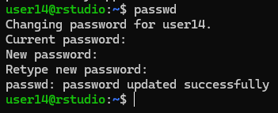
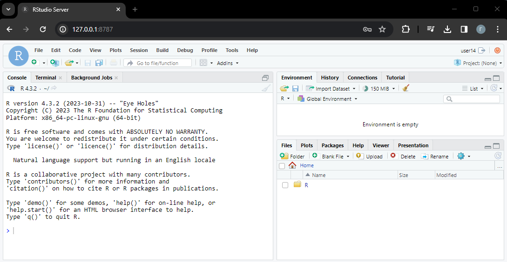

# Применение технологий ИИ и машинного обучения для поиска угроз ИБ
Zhidkov Georgy

Лабораторная работа №3

> Анализ данных сетевого трафика при помощи библиотеки Arrow

## Цель

1.  Изучить возможности технологии Apache Arrow для обработки и анализ
    больших данных
2.  Получить навыки применения Arrow совместно с языком программирования
    R
3.  Получить навыки анализа метаинфомации о сетевом трафике
4.  Получить навыки применения облачных технологий хранения, подготовки
    и анализа данных: Yandex Object Storage, Rstudio Server.

## Исходные данные

1.  ОС Windows 11
2.  RStudio Desktop
3.  Yandex Cloud: S3 Object Storage
4.  Yandex Cloud: Yandex Query
5.  Yandex Cloud: Yandex DataLens

## Описание работы

### Общая ситуация

Вы – специалист по информационной безопасности компании “СуперМегатек”.
Вы, являясь специалистом Threat Hunting, часто используете информацию о
сетевом трафике для обнаружения подозрительной и вредоносной активности.
Помогите защитить Вашу компанию от международной хакерской группировки
AnonMasons. У Вас есть данные сетевой активности в корпоративной сети
компании “СуперМегатек”. Данные хранятся в Yandex Object Storage.

### Задание

Используя язык программирования R, библиотеку arrow и облачную IDE
Rstudio Server, развернутую в Yandex Cloud, выполнить задания и
составить отчет.

## Ход работы

### Настройка подключения к RStudio Server

1.  Поменяем права на файле с ssh-ключом, затем, используя его,
    выполняем вход на сервер по ssh.


1.  Меняем пароль у user14



1.  Заходим в RStudio Server под пользователем user14 по адресу
    127.0.0.1:8787



1.  Настраиваем через Personal Access Tokens доступ к Github


### Выполняем задания

#### Устанавливаем библиотеки и датасет

``` r
library(arrow, warn.conflicts = FALSE)
```

    Some features are not enabled in this build of Arrow. Run `arrow_info()` for more information.

``` r
library(tidyverse, warn.conflicts = FALSE)
```

    ── Attaching core tidyverse packages ──────────────────────── tidyverse 2.0.0 ──
    ✔ dplyr     1.1.4     ✔ readr     2.1.5
    ✔ forcats   1.0.0     ✔ stringr   1.5.1
    ✔ ggplot2   3.4.4     ✔ tibble    3.2.1
    ✔ lubridate 1.9.3     ✔ tidyr     1.3.1
    ✔ purrr     1.0.2     
    ── Conflicts ────────────────────────────────────────── tidyverse_conflicts() ──
    ✖ lubridate::duration() masks arrow::duration()
    ✖ dplyr::filter()       masks stats::filter()
    ✖ dplyr::lag()          masks stats::lag()
    ℹ Use the conflicted package (<http://conflicted.r-lib.org/>) to force all conflicts to become errors

``` r
dir.create("data", showWarnings = FALSE)

curl::multi_download(
  "https://storage.yandexcloud.net/arrow-datasets/tm_data.pqt",
  "data/testdata",
  resume = TRUE
)
```

    # A tibble: 1 × 10
      success status_code resumefrom url    destfile error type  modified
      <lgl>         <int>      <dbl> <chr>  <chr>    <chr> <chr> <dttm>  
    1 TRUE            416          0 https… /home/u… <NA>  appl… NA      
    # ℹ 2 more variables: time <dbl>, headers <list>

#### Задание 1: Надите утечку данных из Вашей сети

Важнейшие документы с результатами нашей исследовательской деятельности
в области создания вакцин скачиваются в виде больших заархивированных
дампов. Один из хостов в нашей сети используется для пересылки этой
информации – он пересылает гораздо больше информации на внешние ресурсы
в Интернете, чем остальные компьютеры нашей сети. Определите его
IP-адрес.

``` r
dt <- open_dataset(
  sources = "data/testdata",
  schema = schema(timestamp=int64(), src=utf8(), dst=utf8(), port=uint32(), bytes=uint32())
)

dt %>% glimpse()
```

    FileSystemDataset with 1 Parquet file
    105,747,730 rows x 5 columns
    $ timestamp <int64> 1578326400001, 1578326400005, 1578326400007, 1578326400011, …
    $ src      <string> "13.43.52.51", "16.79.101.100", "18.43.118.103", "15.71.108.…
    $ dst      <string> "18.70.112.62", "12.48.65.39", "14.51.30.86", "14.50.119.33"…
    $ port     <uint32> 40, 92, 27, 57, 115, 92, 65, 123, 79, 72, 123, 123, 22, 118,…
    $ bytes    <uint32> 57354, 11895, 898, 7496, 20979, 8620, 46033, 1500, 979, 1036…

``` r
dataleak_1 <- dt %>%
  filter(str_detect(src, "^12.") | str_detect(src, "^13.") | str_detect(src, "^14."))  %>%
  filter(!str_detect(dst, "^12.") | !str_detect(dst, "^13.") | !str_detect(dst, "^14."))  %>%
  group_by(src) %>% summarise("sum" = sum(bytes)) %>%  
  filter(sum > 6000000000) %>% select(src,sum)

dataleak_1 |> collect()
```

    # A tibble: 1 × 2
      src                  sum
      <chr>              <dbl>
    1 13.37.84.125 11152202376

Ответ: 13.37.84.125

#### Задание 2: Надите утечку данных 2

Другой атакующий установил автоматическую задачу в системном
планировщике cron для экспорта содержимого внутренней wiki системы. Эта
система генерирует большое количество трафика в нерабочие часы, больше
чем остальные хосты. Определите IP этой системы. Известно, что ее IP
адрес отличается от нарушителя из предыдущей задачи.

``` r
dataleak_2 <- dt %>%
      select(timestamp, src, dst, bytes) %>%
      mutate(trafic = (str_detect(src, "^((12|13|14)\\.)") & !str_detect(dst, "^((12|13|14)\\.)")),time = hour(as_datetime(timestamp/1000))) %>%
      filter(trafic == TRUE, time >= 0 & time <= 24) %>% group_by(time) %>%
      summarise(trafictime = n()) %>% arrange(desc(trafictime))

dataleak_2 |> collect()
```

    # A tibble: 24 × 2
        time trafictime
       <int>      <int>
     1    16    4490576
     2    22    4489703
     3    18    4489386
     4    23    4488093
     5    19    4487345
     6    21    4487109
     7    17    4483578
     8    20    4482712
     9    13     169617
    10     7     169241
    # ℹ 14 more rows

Учитывая нагрузку на трафик, рабочее время: 16:00-24:00

``` r
dataleak_2_2 <- dt %>% mutate(time = hour(as_datetime(timestamp/1000))) %>% 
  filter(!str_detect(src, "^13.37.84.125")) %>% 
  filter(str_detect(src, "^12.") | str_detect(src, "^13.") | str_detect(src, "^14."))  %>%
  filter(!str_detect(dst, "^12.") | !str_detect(dst, "^13.") | !str_detect(dst, "^14."))  %>%
  filter(time >= 1 & time <= 15) %>% 
  group_by(src) %>% summarise("sum" = sum(bytes)) %>%
  filter(sum > 290000000) %>% select(src,sum) 

dataleak_2_2 |> collect()
```

    # A tibble: 1 × 2
      src               sum
      <chr>           <int>
    1 12.55.77.96 298669501

Ответ: 12.55.77.96

#### Задание 3: Надите утечку данных 3

Еще один нарушитель собирает содержимое электронной почты и отправляет в
Интернет используя порт, который обычно используется для другого типа
трафика. Атакующий пересылает большое количество информации используя
этот порт, которое нехарактерно для других хостов, использующих этот
номер порта. Определите IP этой системы. Известно, что ее IP адрес
отличается от нарушителей из предыдущих задач

``` r
dataleak_3 <- dt %>% filter(!str_detect(src, "^13.37.84.125")) %>% 
  filter(!str_detect(src, "^12.55.77.96")) %>% 
  filter(str_detect(src, "^12.") | str_detect(src, "^13.") | str_detect(src, "^14."))  %>%
  filter(!str_detect(dst, "^12.") | !str_detect(dst, "^13.") | !str_detect(dst, "^14."))  %>% select(src, bytes, port) 


dataleak_3_1 <- dataleak_3 %>%  group_by(port) %>% summarise("mean"=mean(bytes), "max"=max(bytes), "sum" = sum(bytes)) %>% 
  mutate("Raz"= max-mean)  %>% filter(Raz!=0, Raz>170000)

dataleak_3_1 |> collect()
```

    # A tibble: 1 × 5
       port   mean    max         sum     Raz
      <int>  <dbl>  <int>       <dbl>   <dbl>
    1    37 33348. 209402 48192673159 176054.

``` r
dataleak3_2 <- dataleak_3  %>% filter(port == 37) %>% group_by(src) %>% 
  summarise("mean" = mean(bytes)) %>% filter(mean > 37543) %>% select(src)

dataleak3_2 |> collect()
```

    # A tibble: 1 × 1
      src        
      <chr>      
    1 13.46.35.35

Ответ: 13.46.35.35

## Оценка результата

В результате практической работы был проведен анализ сетевой активности
с помощью Apache Arrow и были найдены утечки данных.

## Вывод

Мы получили навыки работы с Apache Arrow и RStudio Server
